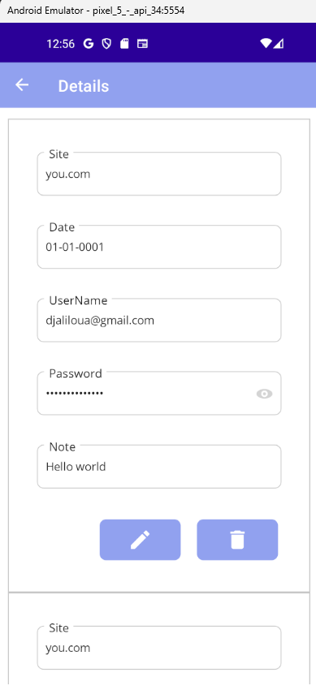
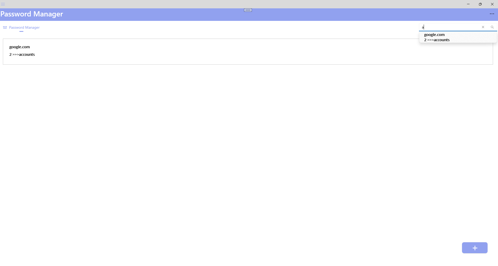
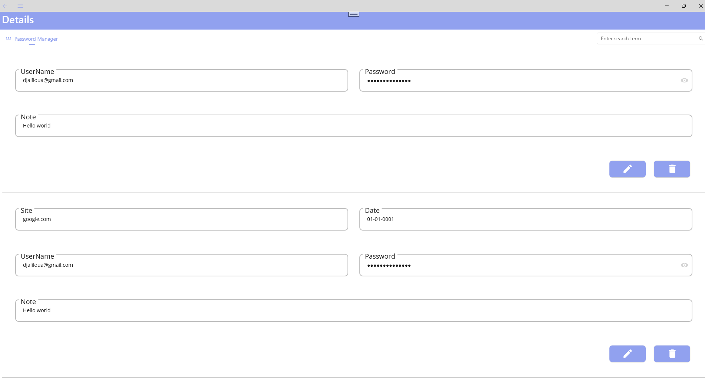

## Password Management System(PMS)
  
### Project description
Password Management System(PMS) is an application for managing and creating password on the fly. 
It makes use of different technologies including MAUI,MVVM, Sqlite, Entity framework, FingerPrint etc...
  
#### Android
  

  
#### Desktop
  
  

