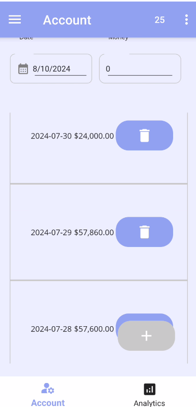
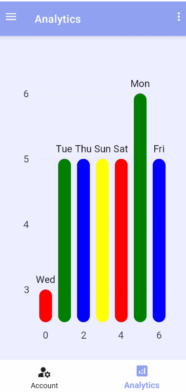
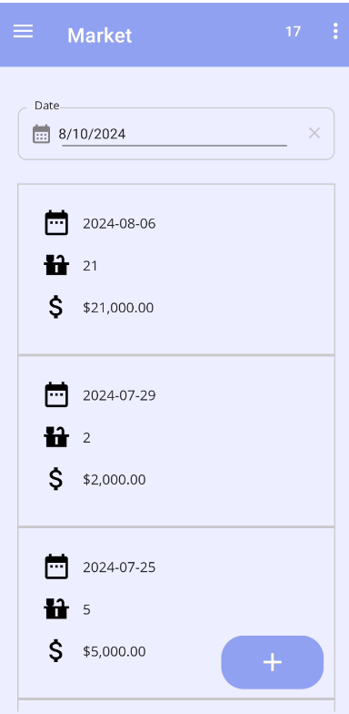

## Purchase Management Application(PMA)
### Project description
Purchase Management Application(PMA) is an application that is used to logging daily operations. 
The app contains three main pages: Account, Purchase and Analytics pages.
- Account Page: Contains estimated total daily expenses.  
  
- Analytics Page: Shows barplot of daily expenses.  
  
- Purchase Page: This page is responsible for adding products that are or will be purchased on daily basis. 
It is also possible to take location where a given product has been purchased by swiping to the right on top of the product.
  

